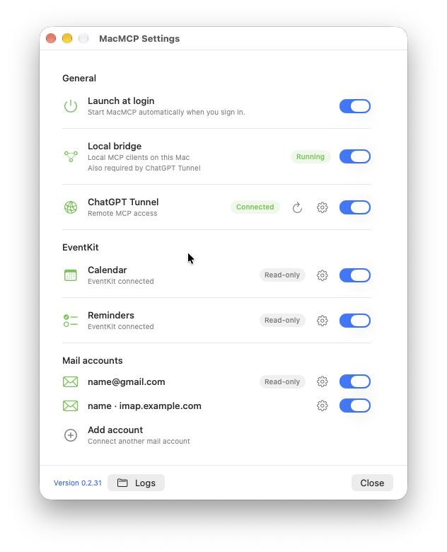

# MacMCP

MacMCP is a local MCP bridge for macOS. It gives an approved MCP client access
to configured mail accounts, Calendar, and Reminders without placing mail
passwords in the client configuration. Mail, Calendar, and Reminders start
read-only. Settings can explicitly enable narrowly scoped mail drafts/message
flags and EventKit actions when you need them.

The app owns the local runtime, stores secrets in macOS Keychain, and exposes a
MCP endpoint. An optional OpenAI tunnel makes the same endpoint available to
ChatGPT.

For the current engineering state, verified behavior, and continuation notes,
see [docs/HANDOFF.md](docs/HANDOFF.md).

## What It Can Do

- Search and read mail from multiple IMAP accounts, including iCloud Mail and
  Gmail.
- Read supported text attachments.
- Read Calendar events and Reminders through EventKit.
- Provide structured MCP responses for reliable client use.
- Create recipient-free managed drafts and change one message's read/unread or
  flagged/unflagged state after **Draft creation allowed** is enabled for that
  account.
- When separately enabled in Settings, create/update Calendar events and
  create/complete Reminders. Repeating events, alerts, and location triggers
  each need their own additional switch.

MacMCP cannot send, delete, move, archive, or modify recipients. It cannot
delete or move Calendar events or Reminders, manage invitations, reopen a
Reminder, or create arbitrary automation. Mail mutations remain blocked until
**Draft creation allowed** is enabled for that account. Drafts have no recipient
fields and cannot be sent.

## Installation

For a Mac that already uses Homebrew, the Cask is the recommended installation:
it installs the app and the `macmcp` command, and future updates are one
command or one Settings button. If Homebrew is unavailable, unwanted, or the
user cannot install it, use the equally supported signed DMG instead.

### Recommended: Homebrew Cask

```bash
brew tap Dimentium/macmcp https://github.com/Dimentium/macmcp
brew install --cask macmcp
macmcp setup --gmail-address you@gmail.com
```

The Cask installs the signed app in `/Applications` and the `macmcp` command.
Its setup accepts repeatable `--gmail-address`, `--icloud-address`, and
`--mail-account` options. Cask upgrades retain configuration and Keychain
secrets:

```bash
brew upgrade --cask macmcp
```

### Without Homebrew: download the release DMG

Use the `MacMCP-<version>-macos.dmg` asset on the [latest GitHub
Release](https://github.com/Dimentium/macmcp/releases). Do not download
`Source code`; the ZIP is the Cask archive and is not meant to be opened
manually.

Requirements: an Apple Silicon Mac running macOS 14 (Sonoma) or later. An
administrator account and Homebrew are not required.

1. Open the downloaded DMG.
2. Drag `MacMCP.app` onto `Applications`. If macOS asks for an administrator
   password, open your Home folder, create `Applications` there if needed, and
   drag the app into that folder instead. `~/Applications` is fully supported.
3. Open `MacMCP` from Applications. If macOS shows a first-launch warning,
   right-click the app, choose `Open`, and confirm once.
4. The MacMCP setup window appears. Mail and the ChatGPT tunnel are optional:
   enable either section only if you need it. For mail, choose Gmail or iCloud
   Mail and enter an app-specific password. The password is saved in the macOS
   Keychain; it is not your normal Google or Apple Account password. Add an
   Other IMAP account later from Settings. For ChatGPT, enter the tunnel ID and
   restricted runtime API key.
5. Leave MacMCP running. `Launch MacMCP at login` is enabled by default.

If you closed the setup window, click the MacMCP menu-bar icon and choose
**Open Settings…**. You can configure Mail, Calendar, Reminders, and the
optional ChatGPT tunnel in one place; you can also leave mail and/or the tunnel
off completely.

To pause personal-data access without stopping MacMCP, turn off **Calendar** or
**Reminders** in Settings. The switch applies to local MCP clients and the
ChatGPT tunnel immediately; disabled tools disappear from the next `tools/list`
response and cached calls receive a fixed denial. Use the gear next to either
row to allow its narrow write actions; both categories remain read-only by
default.

### Settings at a glance

The one-page Settings window is the control surface for local access, the
optional tunnel, EventKit, mail accounts, updates, logs, and Login Item.
Settings are live where possible; only changing mail connection details needs a
runtime restart.



The optional ChatGPT tunnel is configured later from the MacMCP menu. The
release DMG includes a signed `tunnel-client`, so Homebrew is not needed for
tunnel setup either. It is not needed for local MCP use and must not be a
prerequisite for the first launch.

### Connect a local MCP client

Keep MacMCP running in the menu bar, then add this command to your MCP client.
Replace the app path with `~/Applications/MacMCP.app` if you used the
Homebrew-free DMG without administrator access:

```bash
app="/Applications/MacMCP.app"
codex mcp add macmcp -- \
  "$app/Contents/MacOS/macmcp-bridge" \
  --stdio-proxy "$HOME/Library/Application Support/macmcp/mcp.sock"
```

On the first data request, approve the pending client from Terminal. The app
must remain running; the client connects to its private local socket and does
not start the mail or EventKit sidecars itself.

```bash
"$app/Contents/MacOS/macmcp-bridge" --approve-pending-client
```

### Advanced: source install

Use this path only to inspect or build MacMCP locally. It requires macOS 14 or
later, Xcode Command Line Tools with Swift 6.1 or later, Homebrew, Go 1.25.4 or
later, and network access to the pinned GitHub and Swift package sources.

```bash
brew tap Dimentium/macmcp https://github.com/Dimentium/macmcp
brew install macmcp
macmcp setup --gmail-address you@gmail.com
```

The source formula builds the bridge and both sidecars locally; it does not
download prebuilt runtime binaries. macOS may ask for Keychain, Calendar, or
Reminders access on first use. Grant only the permissions needed for the
features you enable.

## Connect ChatGPT

The default local setup works with local MCP clients. To use MacMCP from
ChatGPT, configure the optional tunnel during setup or reconfiguration.

1. Create a tunnel in the [OpenAI tunnel settings](https://platform.openai.com/settings/organization/tunnels).
2. Create a restricted runtime API key in the [OpenAI Runtime API key settings](https://platform.openai.com/settings/organization/api-keys).
3. Configure the tunnel. The MacMCP menu opens a setup window where you enter
   the tunnel ID and restricted runtime API key. The release DMG already
   includes the signed `tunnel-client`; Homebrew is optional.

   ```bash
   # Optional CLI equivalent for a Homebrew install
   macmcp configure --gmail-address you@gmail.com \
     --chatgpt-tunnel-id tunnel_YOUR_ID
   ```

   For a DMG install, open the MacMCP menu-bar icon, choose **Open Settings…**,
   then use the gear beside **ChatGPT Tunnel**. This requests the runtime key
   once and stores it in Keychain; the tunnel ID is stored in MacMCP
   configuration. Settings owns tunnel startup and offers restart,
   reconfiguration, key replacement, and disable controls.
4. Add the resulting MacMCP connector in ChatGPT's Apps and Connectors
   settings. ChatGPT Work is the currently validated client. The advertised
   mail-action tools use the same tunnel but return a clear disabled error
   until **Draft creation allowed** is enabled for that account locally.

The tunnel is optional. Do not create or configure it when local-only MCP use
is sufficient.

## Daily Use

Use the menu-bar item only to open Settings or quit MacMCP. Settings shows
component health, lets you enable or disable Calendar and Reminders access,
manage account-level **Draft creation allowed**, configure the optional tunnel,
open logs, and check for updates.
For a Homebrew installation, `Updates` checks the latest GitHub Release at
launch and every six hours. It enables `Update to <version>` only after a newer
release is confirmed. That command refreshes Homebrew, upgrades the Cask, and
restarts MacMCP. For a DMG installation, download the next DMG, quit MacMCP,
replace the app in the same Applications folder, and open it again; settings
and Keychain secrets remain outside the app.

For a privacy-safe support snapshot, run:

```bash
# Homebrew installation
macmcp diagnose

# DMG installation without administrator access
"$HOME/Applications/MacMCP.app/Contents/Resources/macmcp" diagnose
```

The report includes component states and restart counts, configuration counts,
client-approval counts, Login Item state, tunnel health, and up to 12 recent
tunnel failures. Each tunnel record has only a timestamp, fixed phase, and
fixed reason. It excludes email addresses, client names, paths, tunnel IDs,
command output, and secrets.

For a complete local MCP smoke test from a checkout, run:

```bash
scripts/validate-local-mcp.sh
```

It checks the installed app-owned bridge, all published tools and output
schemas, Mail folder/search/read access, Calendar, and Reminders. It
deliberately skips the ChatGPT tunnel and does not create or modify mail data.

When the ChatGPT tunnel is configured, **Logs** in Settings opens
`~/Library/Logs/MacMCP/`, including `chatgpt-tunnel.log`. The app keeps the active log and up
to four rotated files; each file is capped at 10 MiB. Its one-line records are
readable in Console and include timestamp, level, source, component, message,
and safe status fields. Routine startup noise is omitted. MacMCP records only
valid structured tunnel events and its own lifecycle messages; it discards all
unstructured tunnel output. The log never contains MCP payloads, mail data,
headers, tunnel IDs, or credentials.

`chatgpt-tunnel-proxy.log` in that folder records only each remote
tool category (`mail`, `calendar`, `reminders`, or `bridge_status`) and whether
the local proxy sent back an MCP result. It never records arguments, request
IDs, or result content.

## Updates And Removal

Update a Homebrew installation:

```bash
brew update
brew upgrade --cask macmcp
```

For the advanced source formula use `brew upgrade macmcp` instead.

Remove MacMCP:

```bash
macmcp uninstall
brew uninstall macmcp
```

For a DMG installation, quit MacMCP and move `MacMCP.app` from your
Applications folder to the Trash. Its configuration and Keychain entries are
left in place so a later reinstall can continue where you stopped.

The source formula remains supported after the Cask is published. The Developer
ID release pipeline is one numbered command, documented in
[docs/RELEASING.md](docs/RELEASING.md).

## Third-Party Components

MacMCP directly uses the following upstream projects:

| Component | Purpose | License | Source |
| --- | --- | --- | --- |
| [mail-mcp](https://github.com/Dimentium/mail-mcp) v1.2.5 | IMAP mail sidecar for iCloud Mail and Gmail, including the iCloud folder-list fallback and authenticated managed drafts | MIT | [MacMCP fork](https://github.com/Dimentium/mail-mcp), based on [upstream](https://github.com/kacperkwapisz/mail-mcp) |
| [che-ical-mcp](https://github.com/PsychQuant/che-ical-mcp) v1.16.1 | EventKit Calendar and Reminders sidecar | MIT | [upstream](https://github.com/PsychQuant/che-ical-mcp) |
| [MCP Swift SDK](https://github.com/modelcontextprotocol/swift-sdk) | Local MCP server implementation | MIT / Apache-2.0 | [upstream](https://github.com/modelcontextprotocol/swift-sdk) |
| [Swift System](https://github.com/apple/swift-system) | Swift system interfaces | Apache-2.0 | [upstream](https://github.com/apple/swift-system) |
| [OpenAI tunnel-client](https://github.com/openai/tunnel-client) | Optional ChatGPT Secure MCP Tunnel runtime | Apache-2.0 | [upstream](https://github.com/openai/tunnel-client) |

The exact sidecar revisions are recorded in
[UPSTREAMS.lock.json](UPSTREAMS.lock.json); direct and transitive Swift package
revisions are pinned in [Package.resolved](Package.resolved). The signed
release app embeds the pinned OpenAI `tunnel-client` runtime and its companion
files. A signed app bundle includes the corresponding full license texts under
`Contents/Resources/ThirdPartyNotices`.

## Security Model

- Mail passwords and tunnel keys are stored in Keychain, not in the repository
  or MCP-client configuration.
- Each local MCP client needs approval from MacMCP before it can use data tools.
- A per-account **Draft creation allowed** control fails closed. It gates mail
  actions for all transports, including local MCP clients and the ChatGPT
  tunnel, and can be turned off again immediately without restarting MacMCP.
- Calendar and Reminders actions are separate, default-off Settings controls.
  They allow only the documented narrow actions; additional recurrence, alert,
  and location-trigger controls are independently default-off.
- Managed drafts carry an HMAC marker derived from a Keychain key. Drafts with
  recipients, an invalid marker, or a stale revision cannot be edited.
- The bridge does not expose arbitrary shell, file-system, or automation tools.
- The tunnel uses an explicit restricted runtime key and can be disabled at any
  time from the menu.

See [docs/NAMING.md](docs/NAMING.md) for canonical component names,
[docs/KNOWN_ISSUES.md](docs/KNOWN_ISSUES.md) for known limitations, and
[docs/PLAN.md](docs/PLAN.md) for the current engineering priorities.
